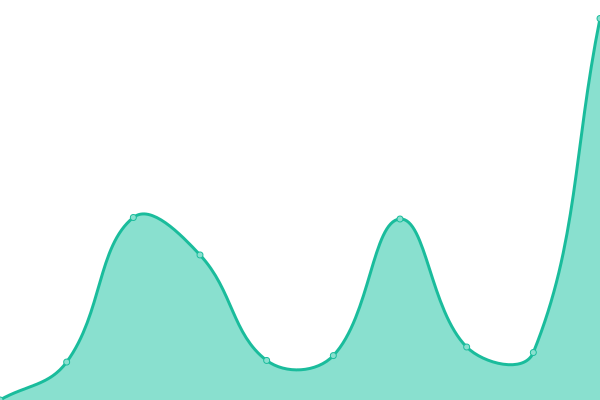

# [📈 Live Status](https://uptime.fichter.eu): <!--live status--> **🟥 Complete outage**

This repository contains the open-source uptime monitor and status page for [F-Fichter](https://uptime.fichter.eu), powered by [Upptime](https://github.com/upptime/upptime).

With [Upptime](https://upptime.js.org), you can get your own unlimited and free uptime monitor and status page, powered entirely by a GitHub repository. We use [Issues](https://github.com/F-Fichter/uptime-smtp/issues) as incident reports, [Actions](https://github.com/F-Fichter/uptime-smtp/actions) as uptime monitors, and [Pages](https://uptime.fichter.eu) for the status page.

<!--start: status pages-->
<!-- This summary is generated by Upptime (https://github.com/upptime/upptime) -->
<!-- Do not edit this manually, your changes will be overwritten -->
<!-- prettier-ignore -->
| URL | Status | History | Response Time | Uptime |
| --- | ------ | ------- | ------------- | ------ |
|  [Test-fichtereu](http://fichter.eu) | 🟥 Down | [test-fichtereu.yml](https://github.com/F-Fichter/uptime-smtp/commits/HEAD/history/test-fichtereu.yml) | 

 0ms
     
 | 

<a href="https://F-Fichter.github.io/uptime-smtp/history/test-fichtereu">0.00%</a>
    

<!--end: status pages-->

[**Visit our status website →**](https://uptime.fichter.eu)

## 📄 License

- Powered by: [Upptime](https://github.com/upptime/upptime)
- Code: [MIT](./LICENSE) © [F-Fichter](https://uptime.fichter.eu)
- Data in the `./history` directory: [Open Database License](https://opendatacommons.org/licenses/odbl/1-0/)
